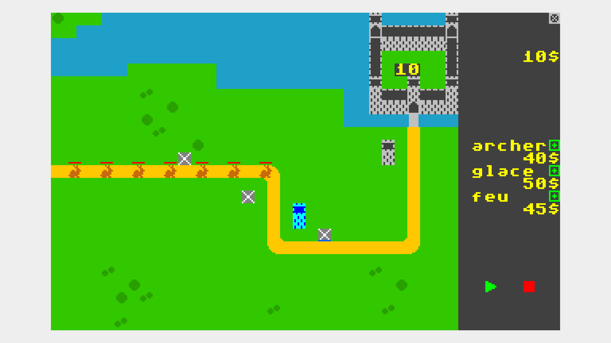

# tower_defense

Tower Defense est un jeu de stratégie où le joueur doit défendre sa base contre des vagues d'ennemis en plaçant des tours le long d'un chemin prédéfini. Chaque tour possède des caractéristiques uniques, comme une portée, une puissance d'attaque et une vitesse de tir.

Le joueur commence avec 10 vies et perd une vie chaque fois qu'un ennemi atteint la base. L'objectif est d'éliminer toutes les vagues avant d'épuiser ses vies. En gagnant de l'argent en jeu, il peut améliorer ses tours ou en placer de nouvelles pour renforcer sa défense.

